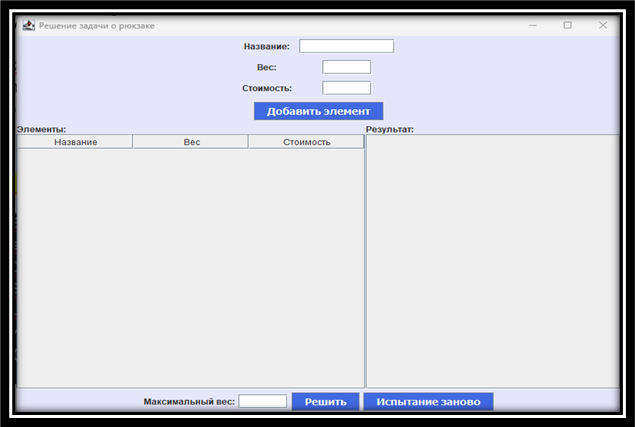

# Решение задачи о рюкзаке: подход и важные части кода



## Введение
Данный проект представляет собой реализацию решения задачи о рюкзаке, включающую использование метода полного перебора (Divide и Trade). Это GUI-приложение на Java, которое позволяет пользователям вводить данные о предметах и находить оптимальный набор предметов, которые можно поместить в рюкзак, с максимальной суммарной стоимостью и ограничением по весу.

## Алгоритм решения задачи о рюкзаке
Алгоритм использует метод полного перебора для нахождения оптимального решения. Основные параметры задачи:

- **Максимальный вес рюкзака (W)**
- **Количество различных предметов (N)**

Каждый предмет имеет следующие свойства:
- **Название**
- **Вес**
- **Стоимость (ценность)**

Цель задачи: найти такой набор предметов, который не превышает максимальный вес рюкзака и имеет максимальную суммарную стоимость.

### Пример данных:
| Название  | Вес  | Стоимость |
|-----------|------|-----------|
| ноутбук   | 2 Кг | 57.5 тыс. руб. |
| книги     | 5 Кг | 10 руб.    |
| гитара    | 7 Кг | 16 руб.    |

### Сложность алгоритма
Метод полного перебора имеет вычислительную сложность O(N!), где N - количество предметов.

## Класс Backpack
Класс **Backpack** реализует алгоритм решения задачи о рюкзаке.

```java
class Backpack {
    private final double maxWeight;
    List<Item> bestItems = null;
    private int bestPrice = 0;

    public Backpack(double maxWeight) {
        this.maxWeight = maxWeight;
    }

    public void solve(List<Item> items) {
        solveRecursively(items, 0, new ArrayList<>(), 0, 0);
    }

    private void solveRecursively(List<Item> items, int index, List<Item> currentItems, double currentWeight, int currentPrice) {
        if (index == items.size()) {
            if (currentWeight <= maxWeight && currentPrice > bestPrice) {
                bestItems = new ArrayList<>(currentItems);
                bestPrice = currentPrice;
            }
            return;
        }

        Item currentItem = items.get(index);

        if (currentWeight + currentItem.weight <= maxWeight) {
            currentItems.add(currentItem);
            solveRecursively(items, index + 1, currentItems, currentWeight + currentItem.weight, currentPrice + currentItem.price);
            currentItems.remove(currentItem);
        }
        solveRecursively(items, index + 1, currentItems, currentWeight, currentPrice);
    }
}
```

### Описание:
1. **Конструктор `Backpack`** - задаёт максимальный вес рюкзака.
2. **Метод `solve`** - инициирует процесс решения задачи.
3. **Метод `solveRecursively`** - реализует рекурсивную логику для нахождения оптимального набора предметов.

## GUI-приложение
### Конструктор BackpackSolverGUI

```java
public BackpackSolverGUI() {
    super("Решение задачи о рюкзаке");
    setDefaultCloseOperation(JFrame.EXIT_ON_CLOSE);
    setSize(800, 600);
    setLayout(new BorderLayout());
    // Инициализация и расположение элементов GUI
}
```

### Описание:
1. Устанавливает название окна, размеры и поведение при закрытии.
2. Использует **BorderLayout** для компоновки элементов интерфейса.

### Метод addItem

```java
private void addItem(ActionEvent e) {
    String name = nameField.getText();
    double weight = Double.parseDouble(weightField.getText());
    int price = Integer.parseInt(priceField.getText());
    Item item = new Item(name, weight, price);
    items.add(item);
    DefaultTableModel model = (DefaultTableModel) itemTable.getModel();
    model.addRow(new Object[]{name, weight, price});
    nameField.setText("");
    weightField.setText("");
    priceField.setText("");
}
```

### Описание:
- Получает данные из текстовых полей и создаёт новый объект **Item**.
- Добавляет созданный предмет в список **items** и отображает его в таблице **itemTable**.
- Очищает поля ввода для нового ввода.

### Метод solveBackpack

```java
private void solveBackpack(ActionEvent e) {
    double maxWeight = Double.parseDouble(maxWeightField.getText());
    Backpack backpack = new Backpack(maxWeight);
    backpack.solve(items);
    DefaultTableModel resultModel = new DefaultTableModel(new String[]{"Название", "Вес", "Стоимость"}, 0);
    resultTable.setModel(resultModel);
    for (Item item : backpack.bestItems) {
        resultModel.addRow(new Object[]{item.name, item.weight, item.price});
    }
}
```

### Метод resetTest

```java
private void resetTest(ActionEvent e) {
    DefaultTableModel model = (DefaultTableModel) itemTable.getModel();
    model.setRowCount(0);
    items.clear();
    nameField.setText("");
    weightField.setText("");
    priceField.setText("");
    maxWeightField.setText("");
    resultTable.setModel(new DefaultTableModel());
}
```

### Описание:
1. Сбрасывает все таблицы и поля ввода в исходное состояние.
2. Очищает список **items** и обновляет интерфейс для нового ввода.

## Заключение
Проект представляет собой визуальное решение задачи о рюкзаке с использованием метода полного перебора, который реализован на Java. GUI-интерфейс позволяет легко взаимодействовать с программой, добавлять предметы и получать оптимальное решение. Код организован так, чтобы его можно было легко модифицировать и расширять для дальнейшего развития проекта.
